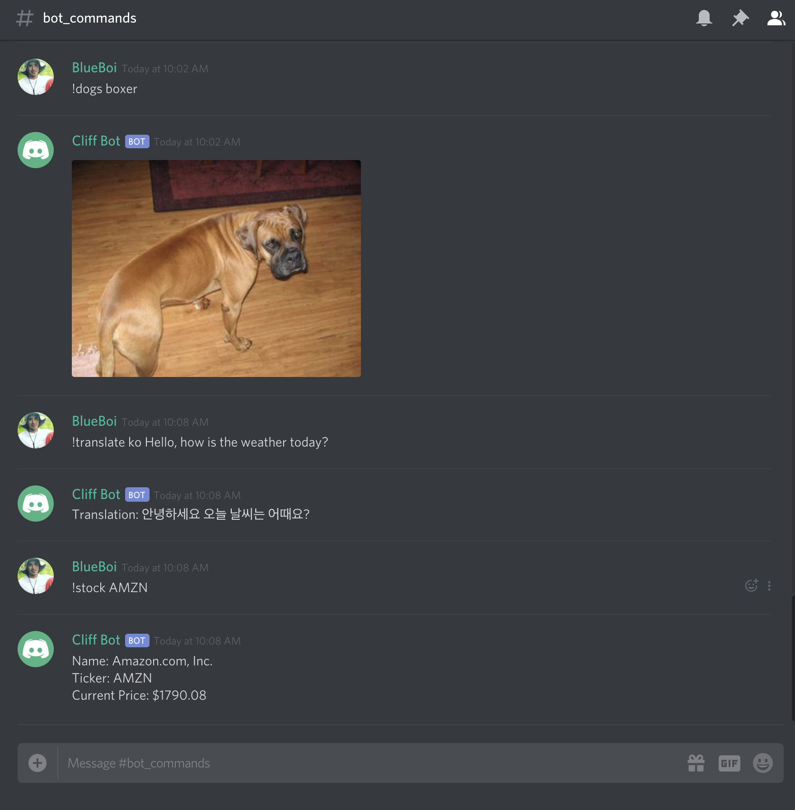

# Cliff-Bot-Discord

Custom Discord bot that can interact with the user by displaying current stock or crypto data, generating random fortune cookies, and many other interesting functionalities.

# Image

# Technologies Used

- NodeJS
- Coinbase API
- Discord API
- WorldTradingData API

# Command List

- !help
- !multiply
- !commands
- !bitcoin
- !fortune
- !stock
- !stocks
- !ping

# What I've Learned

- Handling Promises with Asynchronous, Non-Blocking JavaScript
- Using NodeJS to interact with user through Discord API
